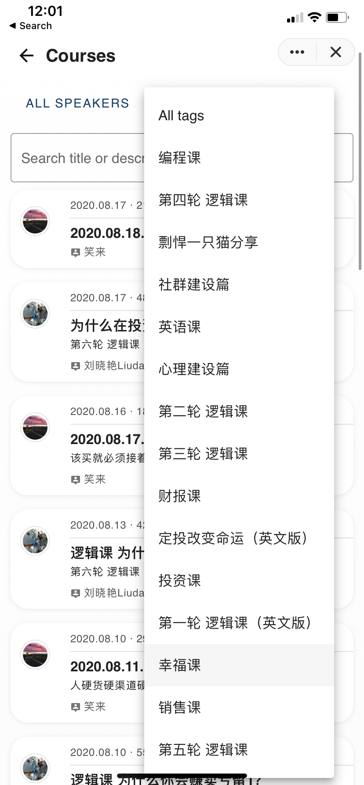

+++
title = "李笑来践行群值得加入吗？"
cover = "/imgs/cover.jpg"
categories = ["Della","BOX"]
tags = ["Della", "BOX", "定投", "Regular Investing", "写作课", "李笑来"]

author = "[Della 在路上]"
date = "2020-08-19T00:00:00-07:00"

isCJKLanguage =  true
useRelativeCover = true

draft = false
+++
## 践行群是什么
践行群是[Minxin](https://mixin.one/messenger)上的一个付费社群，也是一个BOX定投社群，这个社群拥有了一个三千万美元市值的社群基金，且0管理费、0开润、百分之百公开透明。

践行群也是长期践行[《定投改变命运》](https://ri.firesbox.com/#/cn/)理念的成员根据地。想到与真正做到之间有巨大的鸿沟，只有实际去做，做到了，才算真正的践行，

## 社群能带来什么
### 独家课程内容
笑来老师会定期在群内讲课，内容包括区块链资产，投资，成长等话题。时间是奢侈品，如果不好好利用自己的时间，那它就没什么价值。除了学习投资知识，实践定投，更重要的是不断的提升自己。李笑来老师会定期在群里授课，还会邀请各个行业大咖为社区成员授课，比如逻辑课 (极其重要但我们的传统教育却从未教授)，编程课 (Python)，英语课，写作课，幸福课，财报课等。

### 人脉
不断学习并提升自己实力，做长期主义者，社群的每个成员都是定投财富，定投自己的践行者。在这里除却财富的增长，认知水平上的提升，更棒的是可以结交志同道合的朋友。
最近社群开始实施了班级制，这样允许小范围内更高质量的互动，大家也更积极做分享。很多成员愿意分享自己擅长的知识技能，帮助他人的同时还会结交到新朋友。

### 意外惊喜 Serendipity
相信很多人都听过笑来老师给自己创作惊喜的方法论，如果你还没有读过，那一定不要错过[这篇](http://xiaolai.co/books/1ef3bd91da19da1423a7c04fe1882ec9/A18.html)[。

有的人逻辑不好，概率学不懂，容易盲从他人，对真正的原因和事实却视而不见，早早在个人提升上稀里糊涂放弃了自己。践行群能极大程度上帮我们获得意外惊喜，帮助我们保持开放，创造有意义的连接，充实自己同时随时迎接新的机遇。

## 加入条件：
1. 2020元等值的比特币 (可在Mixin内直接购买)
2. 邀请码

### 步骤：
1. 下载Mixin客户端
2. 注册后点击右上角搜索按钮，输入践行群群号：`7000102069`
3. 点击`添加联系人`后，再点击左下方的机器人按钮进入群主页
4. 接下来会有弹出窗口，请点击“授权”按钮
5. 输入邀请码 `P99QPCG9MR` 加入
6. 付费成功后自动加入群组

---
公众号[Della在路上]

---
欢迎打赏

[BOX](https://b.watch/): `0x21A7eE2E71C61C9311CfF6b11Be6d00E4BdaAD6E`

[BTC](https://bitcoin.org/): `17WAegmR9wyAvAnjnYWx41LmPQbPvZeyTi`

---
BOX 定投践行群 - 长期主义者的乐园 - 心理建设 - 逻辑思维 - 编程 - 投资践行

[Mixin Messenger](https://apps.apple.com/us/app/mixin-messenger/id1322324266): 践行群ID `7000102069`

邀请码: `CH5XS4Z6`