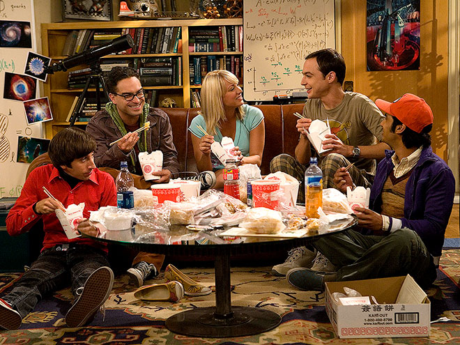
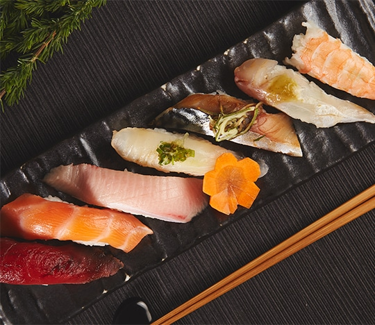
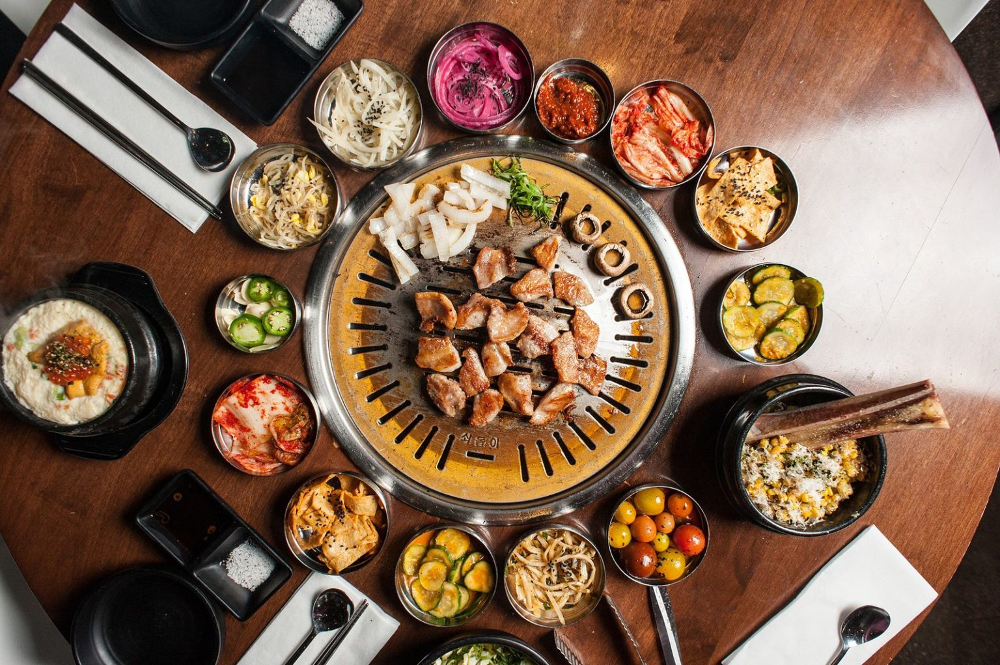

+++
title = "Ali Wong 教你如何甄别好吃的亚洲餐馆"
cover = "/imgs/cover.png"
categories = ["Della"]
tags = ["Della", "food", "Ali Wong"]

author = "[Della 在路上]"
date = "2020-08-17T00:00:00-07:00"

isCJKLanguage =  true
useRelativeCover = true

draft = false
+++

在国外提到中餐，第一个想到的可能是是橘子鸡 (orange chicken) ，幸运饼干(fortune cookie) 这些被本土化的“美式中餐”。
 

美式中餐接受度很高，很多美剧都会出现经典的外卖餐盒🥡。熊猫快餐 (Panda Express) 和华馆 (P.F. Chang‘s) 是最具代表性的连锁美式中餐，和麦当劳差不多，美国大中小城市随处可见。

虽然老外爱吃，但中国人却不买账。甚至亚裔脱口秀演员Ali Wong直接在写给女儿的书里喊话 —— “要是发现你们去吃 P.F. Chang‘s，那你们就不是老娘的闺女！”

出生于旧金山，爸爸中国人，妈妈越南人，Ali Wong 从小就是吃地道的亚洲美食长大，后来遇到他的老公Hakuta (日本菲律宾混血)，俩人一起练瑜伽，去墨西哥喝死藤水，相恋四年后结婚。Ali 还把原先素食主义的老公掰成了和她一样的肉食动物。

对于“美式”亚洲美食，Ali 一直嗤之以鼻，她总结了一些实用技巧可以迅速帮你鉴定一家馆子是否正宗地道，包括中餐，韩餐，越南餐，日餐，菲律宾餐。

## 地道的越南餐馆

- 早上七点开门，晚上8点关门
- 菜单背后都是本地的牙医/律师广告/房产中介广告
- 所有员工穿露趾拖鞋
- 收银处立有佛像，旁边还闪烁着红色的电子蜡烛
- 服务员留着长指甲，可能碰到你的食物，但没关系
- 只收现金
- 餐馆名字里有数字

### 不好吃的越南餐馆

- 顾客拿着叉子吃pho
- 服务员都是白人
- 居然收美国运通信用卡(手续费高)
- 不提供牛筋或牛肚
- 菜名用谐音梗，比如 “What the Pho”，“Pho Gettaboutit”

## 地道的中国餐馆

- 入口处摆着活鱼水箱
- 服务员打着栗色领结
- 卫生间有半透明的粉色肥皂
- 环境很吵
- 酒水选择匮乏
- 大肉大虾都很快上齐，但想要杯水得等一个小时

### 不好吃的中国餐馆
- 点心里有松露油
- 点心是由托盘送上来的
- 服务员态度很好，”“很高兴见到你”，“还想吃点什么甜品吗”，“谢谢”，还问“一切满意吗？“

## 地道的日本餐馆

- 背景音乐是爵士
- 背景音乐会放日本歌手翻唱的美国歌曲
- 卫生间是 Toto 洁厕马桶
- 什么时候蘸酱油有明确要求
- 甜品单里有mochi (不是mochi冰淇淋)

### 不好吃的日本餐馆
- 背景音乐放嘻哈
- 食物里用假的蟹肉
- 在加州的Malibu
- Drake在那吃过
- 具体哪家不说，怕Malibu的日本帮派找上来
- 生鱼片上放20种原料
- 老板是中国人或韩国人

## 地道的韩国餐馆

- 服务员没问你就用剪刀帮你剪肉
- 一面油腻的墙上贴的都是你不认识的韩国名人合影
- 要会说韩语的朋友帮你点菜，顺便多要点小菜
- 筷子和装米饭的碗都是金属的
- 窗户上贴着报道他们餐厅的报纸

个人感觉这些参考都挺靠谱，尤其是Ali对越南餐馆的观察。盼着疫情早点结束，餐馆行业能快一点熬过这场寒冬。

---
公众号[Della在路上]

---
欢迎打赏

[BOX](https://b.watch/): `0x21A7eE2E71C61C9311CfF6b11Be6d00E4BdaAD6E`

[BTC](https://bitcoin.org/): `17WAegmR9wyAvAnjnYWx41LmPQbPvZeyTi`

---
BOX 定投践行群 - 长期主义者的乐园 - 心理建设 - 逻辑思维 - 编程 - 投资践行

[Mixin Messenger](https://apps.apple.com/us/app/mixin-messenger/id1322324266): 践行群ID `7000102069`

邀请码: `CH5XS4Z6`