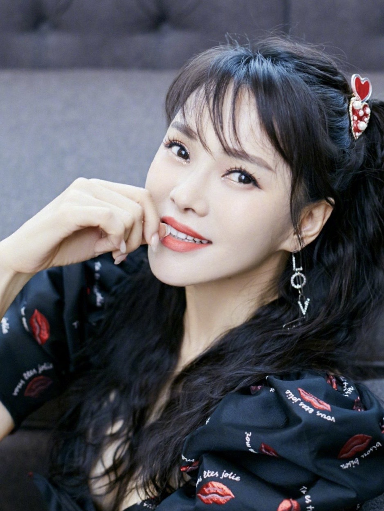
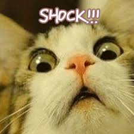
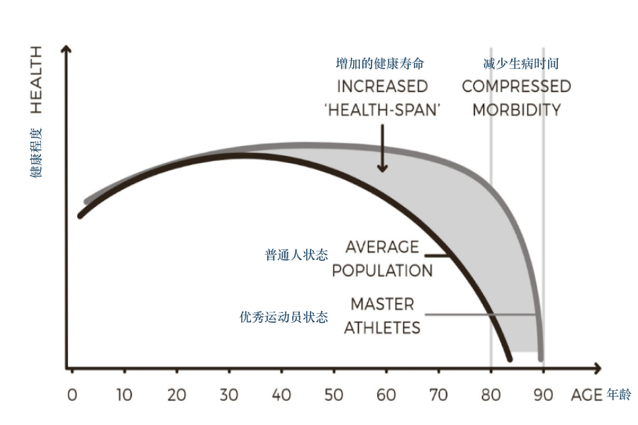
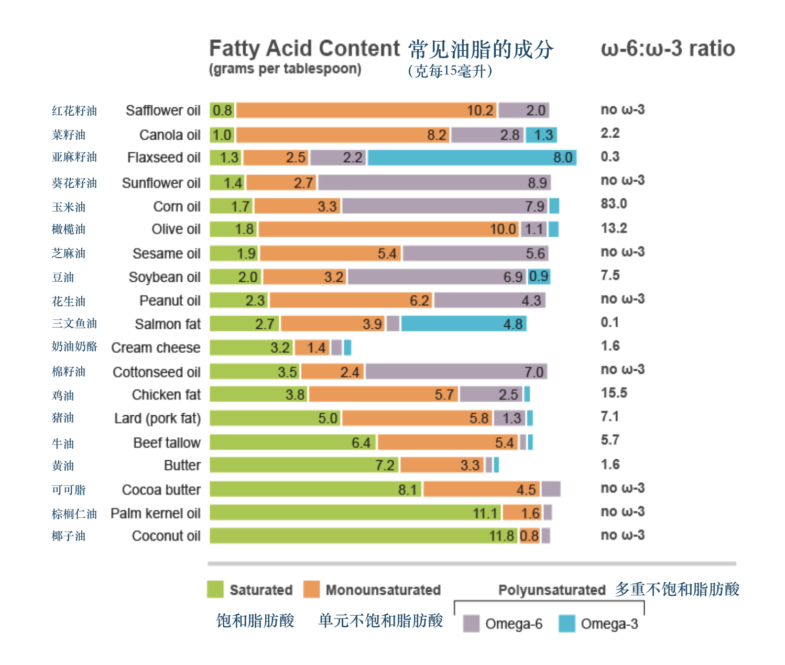

+++
title = "简明实用抗老指南 | 写给家人朋友"
cover = "/imgs/cover.jpg"
categories = ["Della", "定投“，”践行"]
tags = ["Della", "抗老", "Anti-aging"]

author = "[Della 在路上]"
date = "2020-07-29T00:00:00-07:00"

isCJKLanguage =  true
useRelativeCover = true

draft = false
+++

最近跟风追了浪姐，被里面年近半百的伊能静惊到了，皮肤紧致身材苗条，很难想象已经 52 岁了！

好奇这些明星吃了什么仙丹，居然如此青春永驻。一番搜索发现女明星在保养上非常舍得砸钱，伊能静早前在采访中透露自己一年的保养费高达七位数，张雨绮也低调说过自己每月保养护肤费用在 70w。

相信 (mei) 科学 (qian) 的我秉着认真求是的态度，做了关于有效【抗老】的功课，希望对大家有帮助。以下干货预警：

## 抗衰老 (Anti-aging)

这哥们叫 P. D. Mangan，已经 65 岁，是位微生物学家，抗老专家，我们先感受下他的状态：

P. D. Mangan 之前身体状况很差，长期感到疲惫，他试图从主流的营养学建议中找到方法，发现媒体宣称的大多是鬼扯，有些甚至是完全错误的。直到他开始研究一手文献，并亲自实践，才自己找到症结，也使得很多人从他的建议中受益。

他出版了很多书，都是教大家如何饮食锻炼，保持活力。他也有很多明星客户，比如我的偶像 Nassom Taleb 就在推上为其背书。

P. D. Mangan 最新的一本书叫《抗衰老革命》(Anti-aging Revolution)。 他详细解释了如何科学抗老，数据都是来源于一手的科研结果，每一个点都有出处，文献索引几乎占整书篇幅的一半。

## 总体寿命与健康寿命

总体寿命 (lifespan) 就是从出生到死亡的总时长，而健康寿命 (health span) 是指处于健康状况下的生命长度 (活蹦乱跳的时间)。最理想的状况是总体寿命大多都是健康寿命，其次就是要缩短生病的时常 (compressed morbidity)。

此篇不夹杂任何年龄焦虑，只是想科学探讨如何提高健康寿命，少受疾病困扰。接下来会从**锻炼**，**饮食**和**环境因素**三个主题入手，分享科学抗老的原理，误区及具体做法。

## 锻炼

身体机能很大程度上会影响寿命以及是否会得慢性疾病。锻炼的主要目的是为了调节身体结构指标。众多指标中，提高肌肉与脂肪比和增加心肺功能对于减缓衰老有很大积极影响。

体重和健康与否其实关系不大，脂肪过多才会影响健康。如果体重正常但身体脂肪比例过高，也有可能会患跟肥胖相关的疾病 (体脂并不是越低越好)。

提高**肌肉脂肪比**最简单的做法就是**力量训练**，**高强度间歇训练(HIIT)**，以及大量**补充蛋白质**(饮食或蛋白粉)。

力量训练对绝大多数人都适用 (无论性别与年龄)，不仅会增加肌肉量，让骨骼更强壮，还会增加大脑内“海马体”的体积。由于与记忆存储有关，海马体的萎缩往往伴随着衰老，这一点在老年人身上尤为明显。

力量训练最好是复合训练，也就是可以同时锻炼到多个大肌群，比如使用杠铃的负重深蹲和硬拉等。大部分健身器械虽然看起来靠谱，但却基本只针对单个肌肉群。抛开锻炼初期，器械训练不利于力量的长期增长与肌肉群之间的协调。

另一个要点是要努力突破之前的重量，练到“力竭”。这样会促进肌肉的“过度”修复而达成肌肉和力量的增长。

如果想要练出好看的“完美身材”，需要专业的指导和严格饮食规划；但如果主要目的是抗老，那么专注力量训练就够了，除了长肌肉还会有“副作用” —— 减脂以及患糖尿病概率下降(身体对胰岛素敏感度上升)。力量训练相对省时，每周至少一到两次，每次 30 分钟有效训练就足够了。

增加心肺功能最省时有效的方式之一是 HITT (高强度间歇训练) —— 锻炼强度高，时间短，中间有很多间歇休息，能大幅提高细胞能量转化效率 (2017 年的一项研究表明能提高 69%左右)。

分享一个粗略判断代谢水平是否健康的小办法。首先测量腰围 (绕肚脐一周) ，如果腰围小于或等于身高的一半，代谢水平就大概率正常。

关于具体的锻炼方式，这里只是抛砖引玉，以后有机会展开细聊。

## 饮食

饮食首先要有效满足身体的宏观营养物质需求 —— 主要是碳水化合物 (淀粉，糖分等)，脂肪，蛋白质和纤维。总体来讲要**增加蛋白质摄入**，**减少精制碳水化合物，籽类油和铁元素**的摄入。其次，可以通过给身体**适量的刺激**(茶多酚，生物碱，少量饮酒，轻断食等)来增强身体修复机制。

### 增加蛋白质摄入

蛋白质对肌肉量的维持和增长非常重要，但是摄入量却普遍缺乏，尤其是我们习惯的传统中餐。一般来讲，普通人每天需要蛋白质 1-2 克每公斤体重 (60kg 需要约 60-120g 蛋白质)，运动当天更应该多补充蛋白质。

蛋白质含量较高的主要是肉类，蛋类等 (shout out to 张文宏医生 👨‍⚕️)，如果从日常饮食中难以获得这么多蛋白质，可以买些蛋白粉来补充，比如分离乳清蛋白 (动物蛋白成分配比优于植物蛋白，分离蛋白优于浓缩蛋白)。其他宏观营养物质比较容易通过饮食获得，就不单独来写了。

### 减少精制碳水化合物摄入

过分食用精致碳水化合物 (比如馒头，白面包，糖果等) 会提高基础血糖，降低身体对胰岛素的敏感度，从而增加患糖尿病以及心脑血管疾病的风险，加速衰老。另外很多研究表明，减少整体卡路里摄入也会帮助减缓衰老。

最好少吃或避免以下食品：

- 面包和糕点
- 包装售卖的零食
- 糖果和甜品
- 肥宅快乐水 (可乐，雪碧等苏打饮料)
- 方便面
- 鸡米花鱼柳等加工油炸食物
- 精加工的冷冻速食 (披萨等)

### 适当油脂摄入，减少籽类油摄入

一个常见误区是饱和脂肪酸摄入对健康不利。实际情况刚好相反，饱和脂肪酸摄入不足反而与心脑血管疾病成正相关。

反式脂肪酸 trans fat 对健康不利。因为身体无法消化，所以会堆积在血管壁上，导致血栓等 (奶茶店常用的奶精就是反式脂肪酸)。

食物中比较常见的不饱和脂肪酸是 omega-6 和 omega-3。籽类油含有大量的 omega-6 不饱和脂肪酸 (亚麻籽油是例外)。Omega-6 会引起身体发炎反应，而且受热氧化后会产生一种叫 HNE 的化学物质。HNE 会损伤细胞膜，DNA，蛋白质和血管，与心脑血管疾病，神经退化症状有很强的正相关。

由于价格低廉，食品生产商往往会加入大量籽类植物油，所以尽量少吃加工食品。以下是我们要尽量避开的油类：

- 玉米油
- 豆油
- 花生油
- 芝麻油
- 葵花籽油
- 菜籽油
- 棉籽油

可以选择多吃 omega-6 含量低，单元不饱和脂肪酸或 omega-3 含量高的油脂，比如：

- 橄榄油
- 牛油果油
- 黄油
- 椰子油
- 三文鱼脂肪

注：牛油果和橄榄不是种子类油，是果实类。

上图是常见油脂的脂肪配比 (饱和脂肪酸，单元不饱和脂肪酸，omega-6，omega-3 不饱和脂肪酸)。单元不饱和脂肪酸与 omega-3 比例高的比较健康 (比如橄榄油)。

### 适当减少铁元素摄入

体内过多铁元素也会导致衰老，它会导致自由基损伤和蛋白质变性，而且血液中铁元素含量高和许多疾病有很强正相关。

体内铁含量 (安全范围内) 较低的人往往更健康，所以不用执迷买一口神奇的铁锅了。同理，适当献血对整体健康水平有帮助；还有，女生会来例假也许是平均寿命高于男生的原因之一。

### 适度压力和刺激

”那些没能杀死我的，使我变得更强大 (What does not kill me makes me stronger)“，这句尼采一百多年前写在书里的话被美国偶像凯莉·克莱森 (Kelly Clarkson) 唱火了。
有意思的是，在饮食中也有个类似的概念，叫毒物兴奋效应 (Hormesis)，可以粗暴地理解为低剂量压力或毒素反而对身体有益，这点在《反脆弱》里也有被提及。

低剂量压力反而对身体有益

很多地方文化都有**辟谷**的习俗，不少宗教里面也有**斋月**。节食的时候，身体以为自己身处环境“险恶”，从而激活维护机制。其中就包括自噬(autophagy)— 受损细胞会被优先降解，既可促进原材料回收重新利用，还可以通过减少受损细胞数量来增强宏观器官功能，延缓衰老。

适度轻断食还能降低血糖，增加身体对胰岛素的敏感度。研究表明，**轻断食 16-24 小时效果最佳**，所以一个简单的方案是偶尔不吃早饭，前一天 6 点多晚餐到第二天中午差不多 18 小时。

植物产品中很多对身体有益的物质其实是毒素，最常见的就是茶叶里面的多酚类，生物碱(咖啡碱，茶碱，可可碱等)。对抗老有帮助的有：

- 咖啡
- 红酒
- 黑巧克力
- 莓类及其他水果
- 蔬菜，主要是十字花科 (西兰花，白菜等)

重度饮酒对健康有伤害，但轻度到中度饮酒(每天 1-2 杯)与长寿健康有正向关系。(之间没有饮酒习惯不用因此开始频繁喝酒)

如果你每天喝杯咖啡，喝两杯茶，两杯红酒，吃点儿黑巧，多酚类的摄入量就够够的了(1250 毫克)。

### 关于抗氧化剂

锻炼本质上也是一种对身体的适当刺激。如果锻炼的强度足够大，就会产生活性氧族物质(ROS)，使身体自己产生抗氧化剂并且激活 DNA 修复机制，从而降低氧化压力促进健康，延缓衰老。

如果运动前后服用维生素 C，维生素 E 等抗氧化剂，那么由于锻炼所产生的 ROS 会被直接中和，对身体有益的机制也不会被激活。

过去的几十年，我们一直被灌输补充抗氧化剂有助于健康，但事实并非如此，如果缺乏才需要补充，比如有些人新鲜疏果摄入较少。

### 长寿的蓝区

蓝区(blue zone) 是由丹·布特纳 (Dan Buettner) 提出的一个概念，他发现世界上一些地区的人均寿命要远高于普通水平，他们到了 90 岁甚至 100 岁还能保持身体健康和活力。蓝区包括日本冲绳、意大利撒丁岛、美国加州的罗马琳达、哥斯达黎加尼科亚半岛以及希腊伊卡利亚岛。

但很可能食物不是导致蓝区居民健康长寿的最主要原因。除此之外，还可能是：

- 抽烟少
- 光照充足
- 总体体重较低，不肥胖
- 个子较矮
- 体内含铁较低
- 少精致碳水摄入
- 强社会连接，信仰宗教，有较强家庭观导致内心平和，免疫力较高
- 受现代化生活影响较少 (电视，汽车，人情疏远)

### 吃素的迷思

早前关于吃素更健康的研究主要是由一个主张素食的基督教派组织支持的，之后更多的研究并没有显示素食者会更长寿，蓝区人们的饮食习惯也没有和素食相关。

## 环境因素

适度压力不仅来自于锻炼和食物，也可以来源于环境。

### 充足光照

适度光照可以让身体产生维生素 D，但这不足以解释光照对身体的全部益处。具体多少光照是最合适的目前尚无定论，但有研究表明光照不足对健康造成的影响可能跟吸烟差不多。

早在 1937 年，就有研究表明美国的水手得皮肤癌的概率比其他同龄人高 8 倍，但是得其他癌症的概率却低大约 40%。排除黑色素瘤，现在早期皮肤癌的 5 年存活率高达 99%，但其他癌症只有 50%左右。一些高纬度地区的居民平均寿命较高也可能是因为光照更充足。

建议平时面部颈部涂上防晒霜，可以露出身体其他部分拥抱阳光 ☀️。

### 冷热环境

目前没有直接证据表明冷热环境会直接延缓衰老，我们可以把它当作一种宏观环境压力，适度有益健康。

洗 14 度左右的冷水澡会提升身体基础代谢水平 3.5 倍左右。也有研究表明，冬泳的人身体抗氧化能力较强，洗 20 度左右的冷水澡两分钟也许对治疗抑郁和慢性疲劳有帮助。

反过来，一周洗桑拿 4-7 次的人得心脏疾病的概率会降低大约 40%，同时发炎也较少。

## 最后划重点

关于抗老，总结下来最重要的几点是：

- 锻炼 —— 力量训练和高强度间歇性训练
- 健康饮食 —— 不抽烟，多吃蛋白质，少吃精制碳水，避免籽类油，铁元素和抗氧化剂，少量到轻度饮酒；避免超重肥胖
- 适当环境刺激 —— 增加日照，可以适当洗冷水澡和桑拿

此篇是写给家人朋友的一个营养指南，男女适用，欢迎分享给你关心的人 ❤️

## 主要参考资料 ​

1. P.D. Mangan (2019).Anti-Aging Revolution: The Art and Science of Living a Long, Healthy Life, https://gumroad.com/l/agNeQ

2. Russo G. L. (2009). Dietary n-6 and n-3 polyunsaturated fatty acids: from biochemistry to clinical implications in cardiovascular prevention. _Biochemical pharmacology_, _77_(6), 937–946. https://doi.org/10.1016/j.bcp.2008.10.020

3. Simopoulos A. P. (2008). The importance of the omega-6/omega-3 fatty acid ratio in cardiovascular disease and other chronic diseases. _Experimental biology and medicine (Maywood, N.J.)_, _233_(6), 674–688. https://doi.org/10.3181/0711-MR-311

~By Della 及影子写手~
